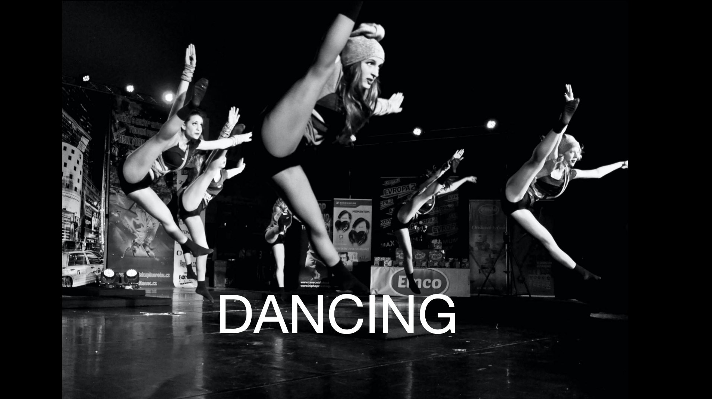
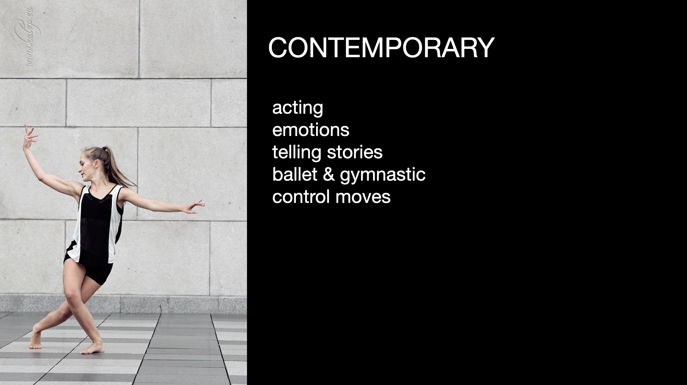
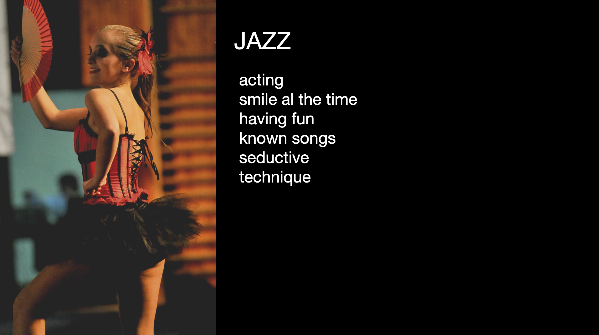
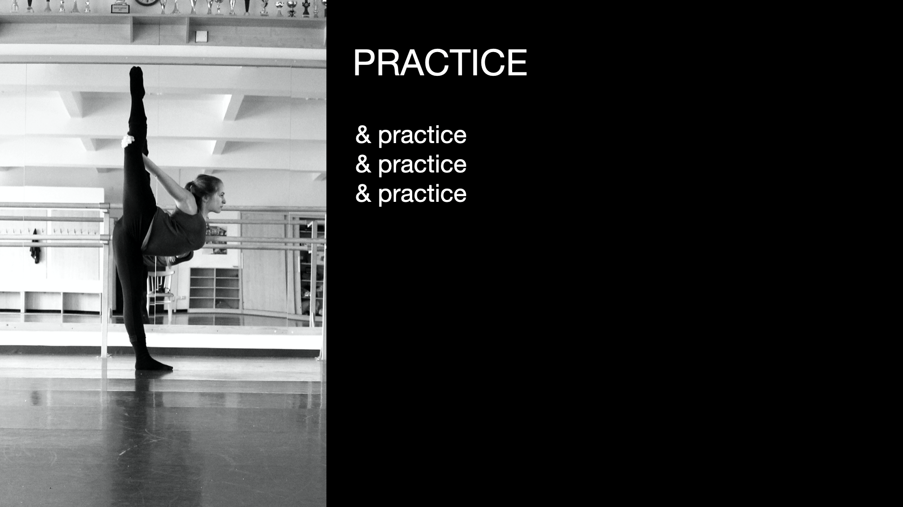

  
  
  I would like to introduce you to my topic of the presentation, my presentation is about dancing, well about me and dancing. 
But first of all I would like to introduce you what is dancing and some of the styles.

### CONTEMPORARY

is a modern expressive dance which, due to its technical similarity, is compared to modern dance and ballet.

### JAZZ

developed on Broadway into a new sleek style, which is now taught as modern jazz dance and has separated from tap

### PRACTICE

It's all about trainings.

