## Visual identity

The bachelor’s thesis examines a rebranding strategy for the dance group Mirákl, based in the Karlovy Vary. The rebranding process explores a new marketing campaign for social media and implements a fresh visual style as part of Mirákl’s brand and corporate identity. The author presents the strengths and weaknesses of the visual communication strategy through brand analysis and interviews with the client.

The practical part focuses on the visual style, logotype, slogans, and marketing messages derived from the benefits of dance as an art form and the unique presentation of the dance group Mirákl. The author’s work aims to strengthen brand awareness, attract a wider audience, and expand media communications.

The theoretical part introduces the reader to contemporary dance as a subject and brand analysis of other dance groups. The practical part explores the rebranding process, from brand philosophy and strategy to the design of core visual and media assets.

The thesis intends to present the possible explications and applied use of the new visual and media communications rebrand.

### Key words: 
Visual communication, dance, dance styles, brand, marketing communication, graphic design, visual identity, social media

## Why I choose this topic?

In the beginning, I was kind of lost. I didn't know the topic of the thesis for a long time. I wasn't sure what I wanna do I didn't know anything. The only thing I knew was that I wanted to do something for a subject from Karlovy Vary. The region I'm from. Because if it's going to be for free, I wanna do it for someone I kind of know. And then the idea came. I thought why wouldn't I do it for a dance company I used to dance in. They are pretty good, winning all the competitions. Why wouldn't I do it for them? I called my trainer, told her my idea, she was pleased and immediately agreed. And that's it. My thesis theme came to life. 

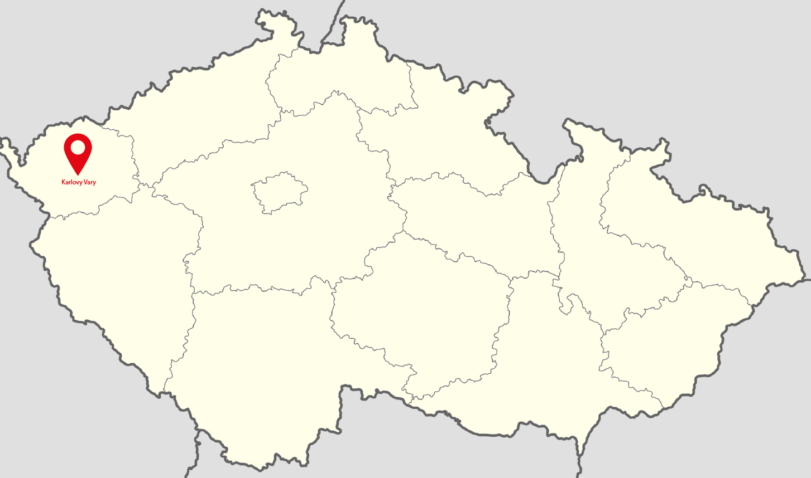

## Dancing

For me, dance is a unique specific expression. It could be a communication between a spectator, a dancer, and telling a story. The dance is mysterious. It can influence a person's imagination. It lets the story be told in his way. That's the thing I love on dancing. Dancing is also a subjective matter. Dance is considered a manifestation of art. It allows you to use your body in a different new way. There are no boundaries.

## Dance company Mirákl

The dance group Mirákl was founded 26 years ago by choreographer Andrea Burešová. Today, the group has about 250 members. In its history, it has had several international and domestic successes. I was a member of the group for 13 years. The group is unique in her dancing style and dancing stories. They are not afraid to tell unique, instructive and stories from history. That's the main thing about them. Mirákl is one of the leaders of the Czech dance scene. She performs in the dance categories Contemporary, Jazz, and Show Dance.

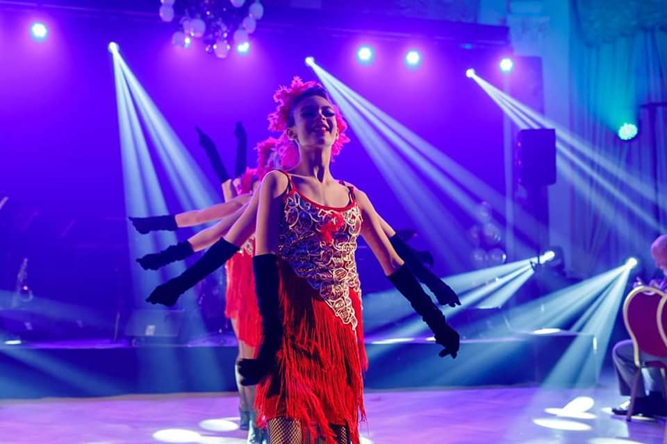

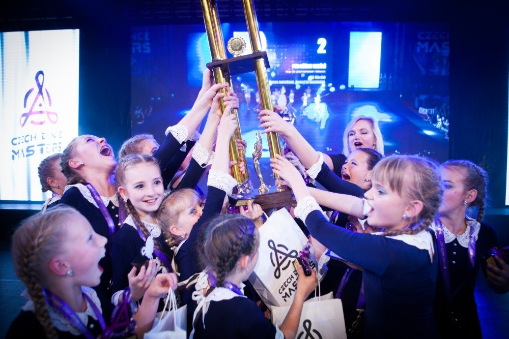

## Inpiration and Mood board

I was lookig for inspiration everywhere. The mood board of the dance group Mirákl is based on the created Brand essence. By creating, I defined the visual tonality. It reflects the idea of connecting two dimensions, dance movement, and connection itself. This process helped me to create a visual identity. In the initial phase of creating a visual style, I looked for sources of inspiration on the Internet based on all visual aspects, outlining the connection, movement, layering, discovery, and the aspect of mystery. My focus was also outside the active dance segment. Inspiration was sought in all industries. Photographs of the dancers themselves for the identity itself became a strong inspiration.

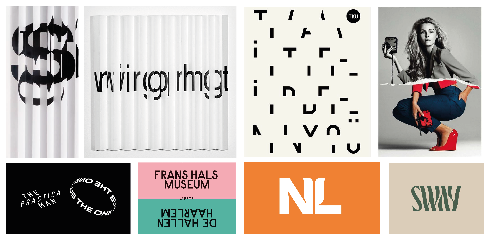

## Work in proces

I bring the individuality of the studio and the dance movement into the visual identity by using dance photographs from performances, competitions, and the dancers of the Mirákl studio themselves. It gave movement into the static form of the visual style. The photographs are the best to demonstrate studio, dance, and dance moves. I design the mentioned connection of two dimensions into the used masks with photographs, which are project into liquid shapes.

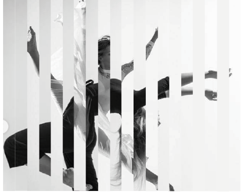

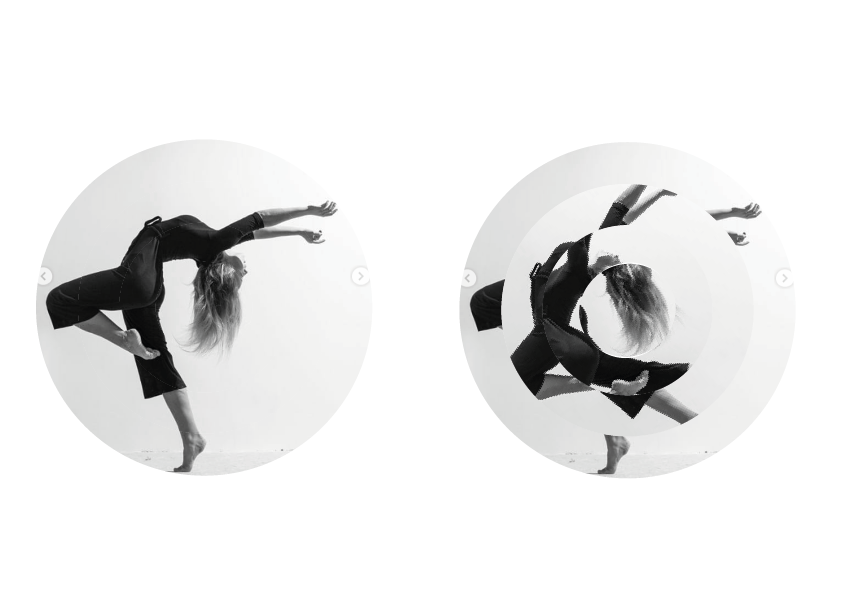

## Logotype

The logotype was created after defining the visual style. Of the planes used, projected in visual identity, the logotype features mostly dance movement. The logo stands on the font destruction. It works on the illusion of wave moves. Its task is to evoke the grace, energy, and fluidity of the dance movement. My intention was not to put down the dance and the dancers, on the contrary, to merge with his movement and complement their unique performances and personalities. Each letter in the logotype is its own, original as a dance movement and the dancer himself. 

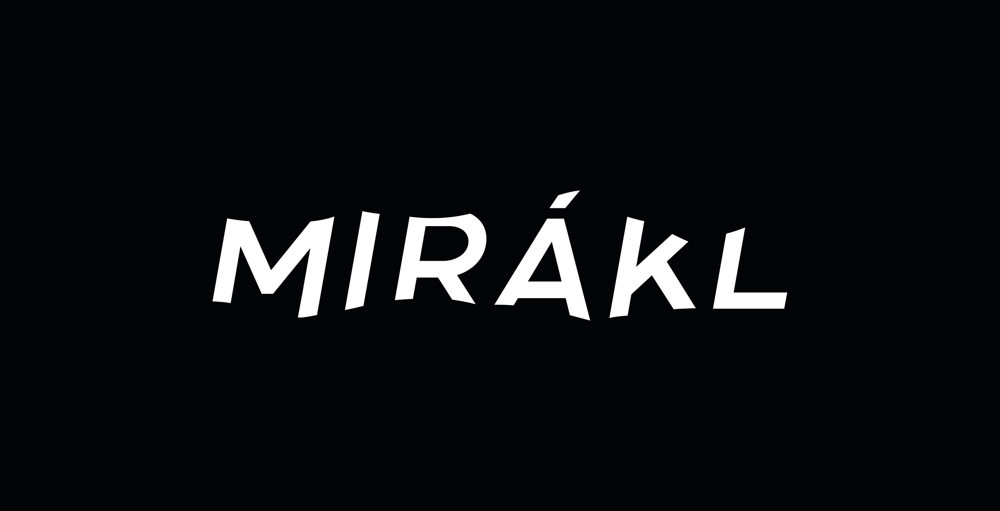

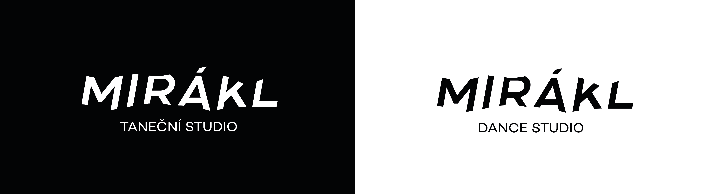

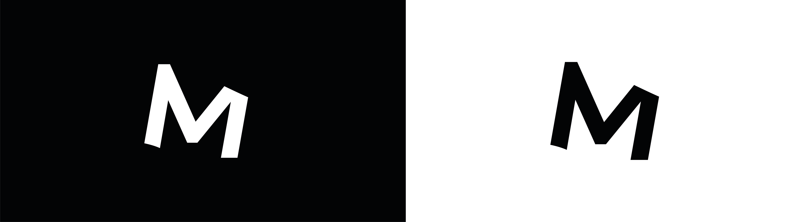

## The final visual identity

## Marketing Communication 

For the dance group Mirákl i have created a brand new communication on social media and marketing messages. The new claim is "taste the story" which is base on the benefit of the group, telling stories. The whole communication has a lot of slogans based on the main claim "taste the story". The social media has a brand new content such as online classes, interviews, a day with a member and so on.

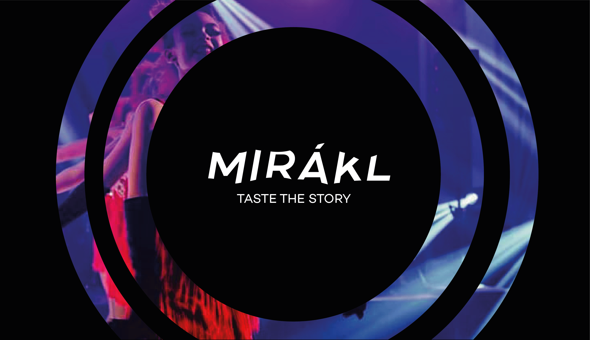

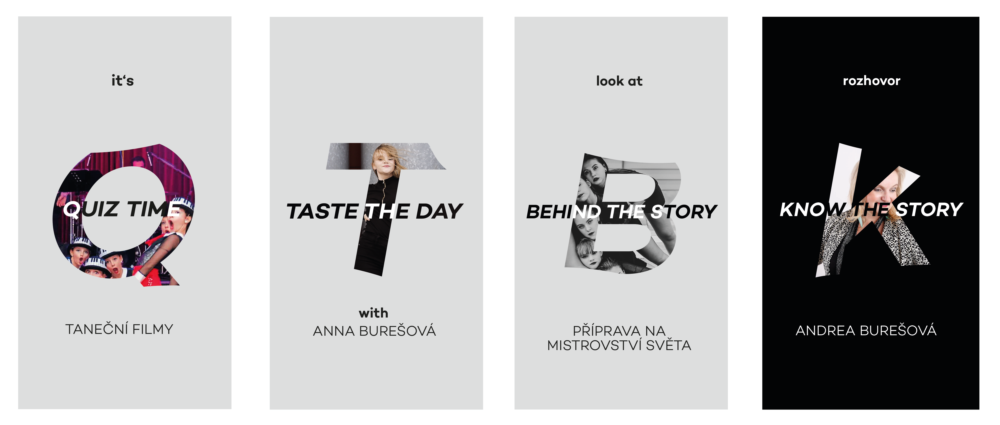

## Merchadinsing 

I'm not using photographs the whole time. In the merch and the explications I'm using liquid shapes in black and white.

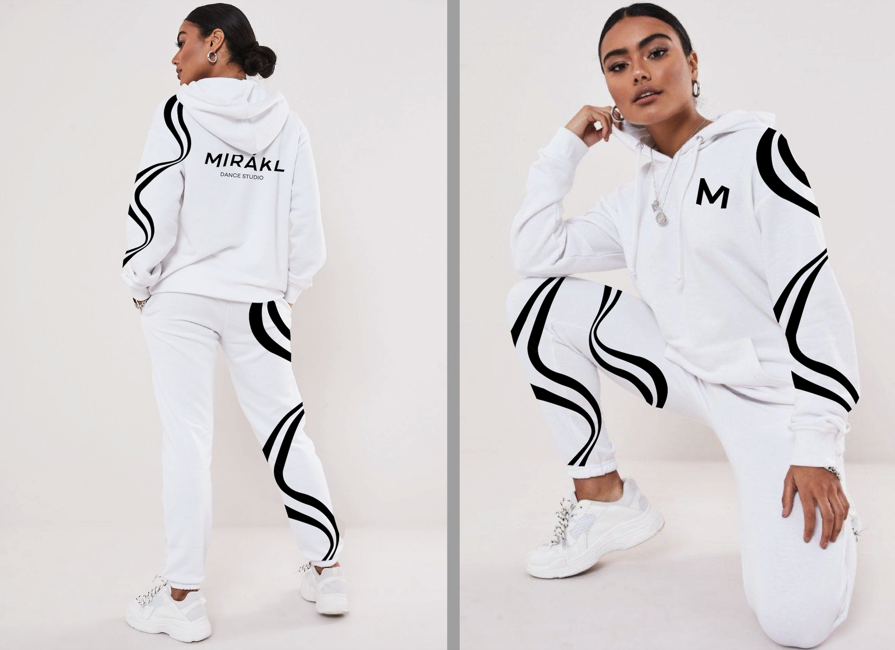

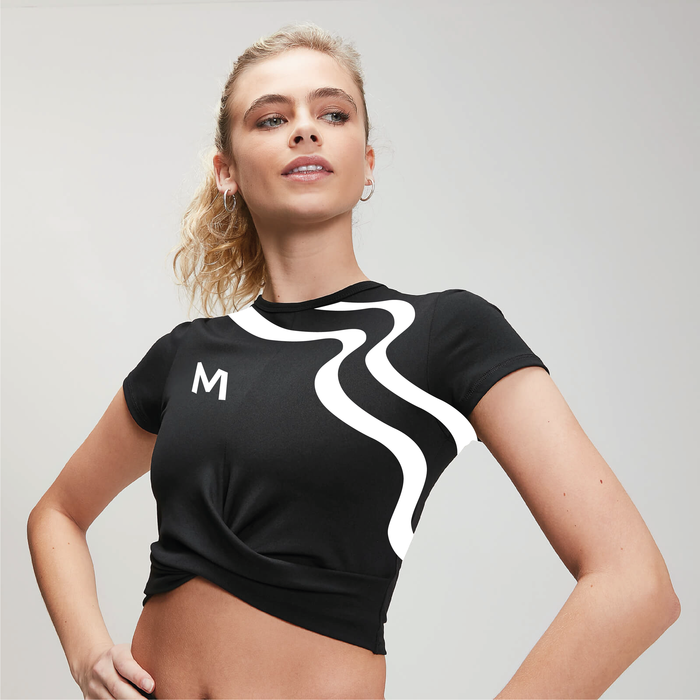

## Feedback

I presented the new brand identity and marketing communication to the dance studio. They loved it. The work is going to be implemented. It should be on their social media, website and others platforms by the end of May. 

